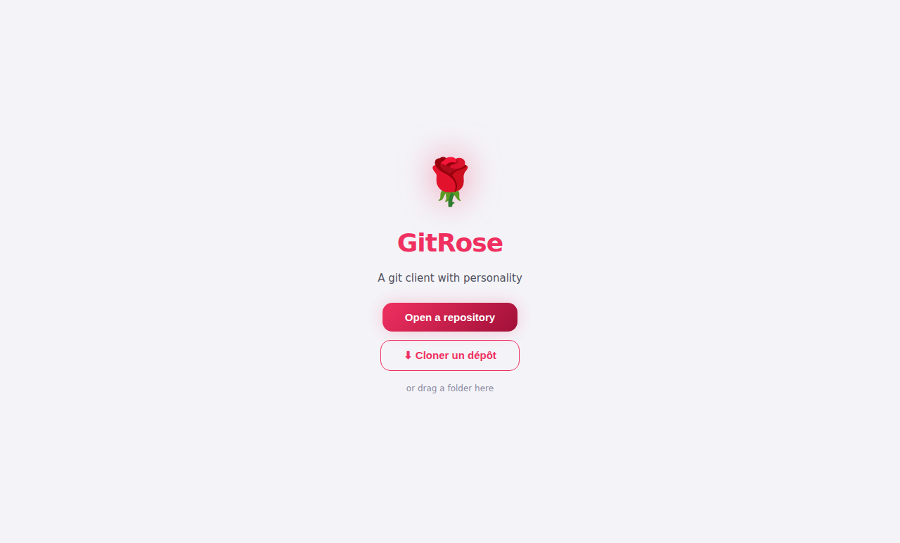
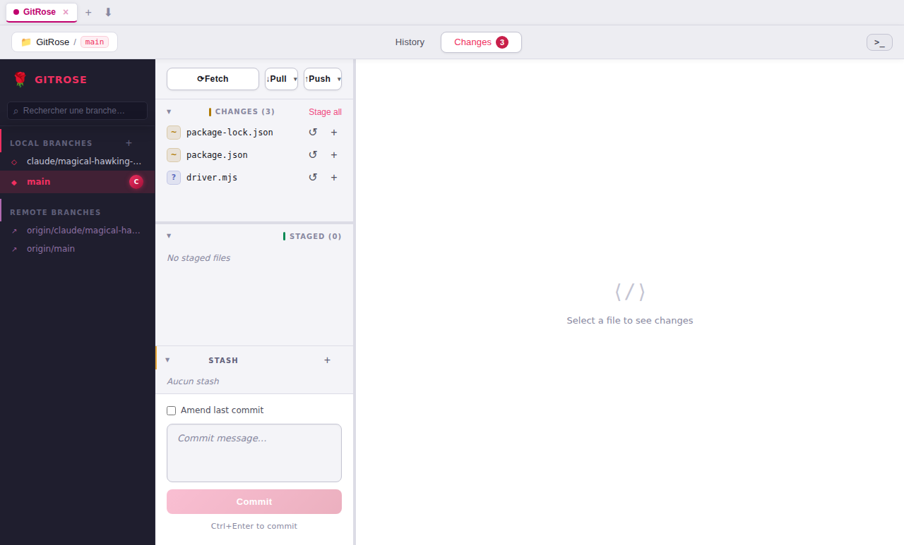
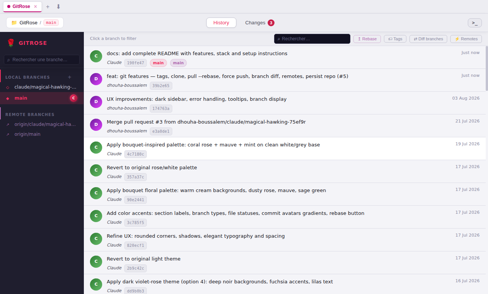
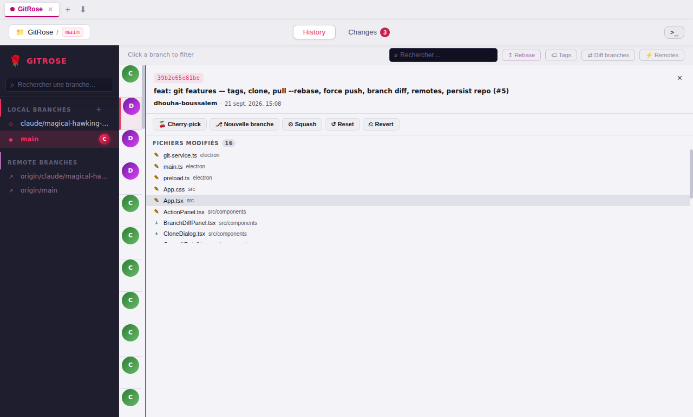

# 🌹 GitRose

A modern, elegant desktop Git client built with Electron, React and TypeScript.

## Screenshots

| Welcome | Changes |
|---|---|
|  |  |

| Commit history | Commit detail |
|---|---|
|  |  |

---

## ✨ Features

### Repository management
- Open multiple repositories in **tabs**
- **Restore** the last opened repo on launch
- **Clone** a repo via URL directly from the UI
- Switch between repos with colored tab indicators

### Commit history
- Flat commit list with author avatars, date, refs and short hash
- **Search** commits by message, author or hash in real time
- Click a commit to see its **full detail** — files changed, inline diff per file
- **Reset** to any commit (soft / mixed / hard)
- **Revert** a commit

### Branches
- Sidebar with local and remote branches
- **Checkout** with double-click, **create** branch inline
- **Rename** and **delete** branches with confirmation dialogs
- **Resizable sidebar**
- Focus a branch to filter the commit list
- **Checkout remote** branches (creates local tracking branch)
- **Merge** a branch into the current one from the sidebar

### Staging & committing
- Visual file list — staged, unstaged, untracked, conflicted
- Stage / unstage / discard individual files or all at once
- Inline **diff viewer** with syntax highlighting
- Commit with message, **amend** last commit

### Sync
- **Push**, **Pull** (merge or `--rebase` via dropdown)
- **Force push** with `--force-with-lease` and inline confirmation
- **Fetch**

### Tags
- List all tags with hash, date and annotation
- Create lightweight or annotated tags
- Delete tags locally and push to remote

### Advanced
- **Branch diff** — compare any two branches, file list + colorized diff
- **Remotes management** — list, add, rename, edit URL, delete
- **Rebase** onto another branch with a single click
- **Cherry-pick** a commit to the current branch or a new branch
- **Squash** commits up to a chosen commit
- **Stash** — list, save, apply, pop, drop, inspect per-file diffs
- **Conflict resolution** panel with ours / base / theirs view
- **Git console** — run any git command and see the output

---

## 🖥️ Tech stack

| Layer | Tech |
|---|---|
| Shell | [Electron](https://www.electronjs.org/) |
| UI | [React 19](https://react.dev/) + [TypeScript](https://www.typescriptlang.org/) |
| Build | [Vite](https://vitejs.dev/) |
| Git | [simple-git](https://github.com/steveukx/git-js) |
| Packaging | [electron-builder](https://www.electron.build/) |

---

## 🚀 Getting started

### Prerequisites
- Node.js ≥ 18
- npm ≥ 9
- Git installed and on your `PATH`

### Install & run

```bash
git clone https://github.com/dhouha-boussalem/GitRose.git
cd GitRose
npm install
npm run dev
```

### Build a distributable

```bash
npm run dist
```

Outputs a platform-native installer (`.dmg` on macOS, `.exe` on Windows, `.AppImage` on Linux) in the `dist/` folder.

---

## 📁 Project structure

```
GitRose/
├── electron/
│   ├── main.ts          # Electron main process, IPC handlers
│   ├── preload.ts       # Context bridge — exposes gitRose API to renderer
│   └── git-service.ts   # All git operations (wraps simple-git)
├── src/
│   ├── App.tsx          # Root component — tab management, layout
│   ├── components/      # UI components (Sidebar, CommitGraph, ActionPanel…)
│   ├── types/git.ts     # TypeScript interfaces + window.gitRose typings
│   └── styles/theme.css # CSS variables and dark theme
└── public/
    └── icon.png
```

---

## 🤝 Contributing

Pull requests are welcome. For major changes, please open an issue first to discuss what you'd like to change.

---

## 📄 License

MIT
